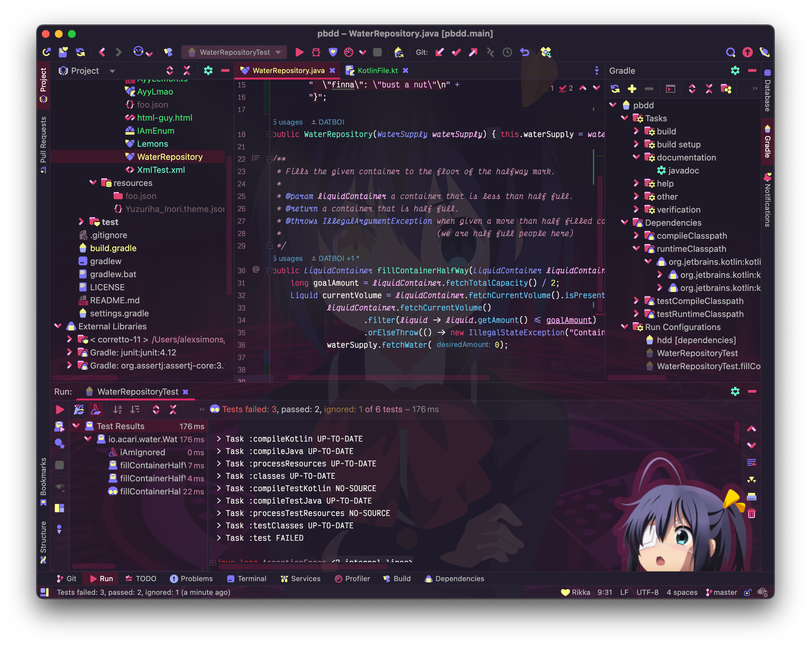

Doki Theme Icons: JetBrains
---

    </img>

## Sample

**Takanashi Rikka**

<!-- Plugin description -->
A nice mix of cool and cute icons to compliment your favorite theme!
<!-- Plugin description end -->

---

# Documentation

- [Installation](#installation)
- [Usage](#usage)
  - [Sync with Doki Theme](#sync-with-doki-theme)
  - [Icon Settings](#icon-settings)
- [Miscellaneous](#miscellaneous)
  - [Attribution Requirements](#attribution-requirements)
  - [Contributing](#contributing)
    - [Icon Requests](#icon-requests)
  - [Helping the community](#enjoying-these-icons)
  - [Release Channel](#release-channel)

# Installation

- Using IDE built-in plugin system (**Notice**: Plugin hasn't been published yet):

  <kbd>Preferences</kbd> > <kbd>Plugins</kbd> > <kbd>Marketplace</kbd> > <kbd>Search for "Doki Theme Icons"</kbd> >
  <kbd>Install Plugin</kbd>

- Manually:

  Download the [latest release](https://github.com/doki-theme/doki-theme-icons-jetbrains/releases/latest) and install it manually using
  <kbd>Preferences</kbd> > <kbd>Plugins</kbd> > <kbd>⚙️</kbd> > <kbd>Install plugin from disk...</kbd>

# Usage

You can access the settings menu here:

<kbd>Preferences</kbd> > <kbd>Appearance & Behavior</kbd> > <kbd>Doki Theme Icon Settings</kbd>

### Sync with Doki Theme

This option is only enabled when you have this plugin & the [Doki Theme for JetBrains IDEs](https://github.com/doki-theme/doki-theme-jetbrains#the-doki-theme-jetbrains-ides) installed.
When enabled, when you change your current theme to another Doki theme, the icon theme will sync with the current theme.

Turning this option off will give you the ability to use a different theme other than for the one was intended.
I do not know why you would want to that, because I specially designed each one to fit each Doki theme perfectly :)

### Icon Settings

- **UI Icons** Are all the icons that are present as part of the user interface (UI).
<!--
- **Named Files** Turns on the ability for the plugin to associate various names of files to various icons. This is only used for when the platform does not already provide a special icon for the file.
-->
- **File Glyphs** Are the icons in the project tree & completion window which symbolize the abstract programming concepts. Such as: Interfaces, Classes, Methods, Variables etc.
- **My Icons** Are a special set of icons that do not necessarily fit the general icon theme, but have special meaning to me.

# Miscellaneous

## Attribution Requirements

As an open source project, attribution is critical from a legal, practical and motivational perspective in my opinion. The graphics are licensed under the CC-BY 4.0 which has a pretty good guide on [best practices for attribution](https://wiki.creativecommons.org/Best_practices_for_attribution).

However, I consider the guide a bit onerous and as a project, and will accept a mention in a project README or an 'About' section or footer on a website. In mobile applications, a common place would be in the Settings/About section. I would consider a mention in the HTML/JS source sufficient also.

## Contributing

### Icon Requests

Something I have learned is that it is a _bunch_ of work developing my own icon suite.
I've built this project for my personal use, meaning I have custom tailored the icons to _my_ experience.

That being said, I've made this public so that I can share this with you.
You probably have your own unique set up, meaning I've missed some icons that you use.

[Feel free to take the time to fill out the icon request form.](https://github.com/doki-theme/doki-theme-icons-jetbrains/issues/new?assignees=Unthrottled&labels=enhancement&template=ICON_REQUEST.yml&title=%5BICON%5D%3A+).
Failure to completely fill out the form will most likely result in me closing & not working the issue.
Please remember that my time is just as valuable as yours, plus I'm doing this just for you.

### Other Requests

Feel free to [start a discussion](https://github.com/doki-theme/doki-theme-icons-jetbrains/discussions) about any feature that you might like.
I do promise to keep an open mind about any features or enhancements you may want.
Please keep in mind, just because you ask or submit a pull request does not necessarily mean you will get it.
Just trying to manage your expectations. :)

Also, please start a discussion about a feature before submitting a pull request. 
Make sure that it is a feature I am willing to support & maintain before doing the work and submitting a pull request. 
Thank you!

## Enjoying these icons?

Great! I am glad you like it!

Be sure to ⭐ and share it with other weebs!

## Release channel

Want updates sooner? I have a [canary release channel](https://github.com/Unthrottled/jetbrains-plugin-repository) that you can set up to get the latest and greatest!

---

    </img>

